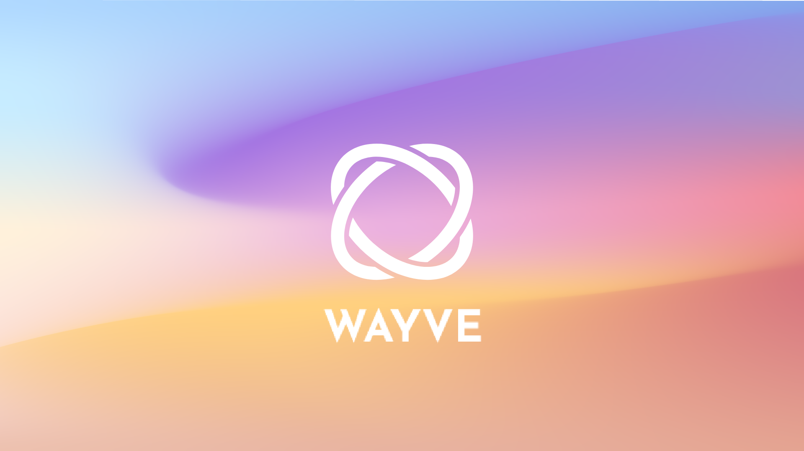
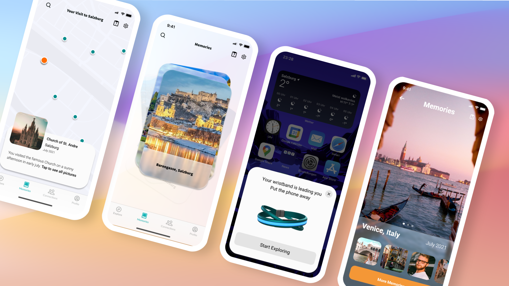

# Wayve - Project documentation

   
**Team Members:** David Sauer, Azur Mešić, Valeria Chavez-Klier, Michael Giang, Ralf Vetter

**Author:** David Sauer (davidsauer@web.de)

This Git project contains our team result during the 2nd Gastrohackathon on November 6/7, 2021 at the Messezentrum Salzburg. Within a 24-hour challenge, our goal was to develop a novel and futuristic concept for the tourism industry in the near future. With Wayve we present a non-digital approach to "drift" through the city like never before. Thanks to its unique approach to enhance the travel experience, tourists can learn more about the city without using any digital device other than a screenless wearable. They can also meet open-minded locals along the way and interact with them intuitively by simply waving at them. Finally, all these memories can be stored on the phone for later retrieval and reliving the journey in nostalgic fashion.

# Important files

- [Link to User Flow](https://whimsical.com/memories-477bN2r2PB5y6mhaZHsFkF)  
The user flow describes three basic flows of the most important interactions. These are meeting locals, finding points of interest (POI), and accessing past memories. The first flow deals with finding a POI. The app does not offer specific locations, instead users are limited to broader options such as "bar/café," museum, beach, etc. The app then randomly selects one of the options available nearby and activates the wristband. The bracelet guides the user to their destination by giving haptic, visual and auditive feedback. There is no other way to find the destination because the goal is to drift and encourage exploration. The second process involves meeting locals. First, the option must be enabled within the app, otherwise the feature is disabled. No further user input is required. Once the user is near a friendly local person, both wristbands vibrate. Users are prompted to wave to the other person. Once both wave, a connection is established and stored in the app. The last feature deals with recapturing experiences. Here, users can see all their pictures, the places they have visited, and all the people they have met and connected with so far.

- `wayve.xd`
The xd-file contains the current state of the companion application which is mainly there to revisit collected experiences in retrospect. After building some rough wireframes in the beginning to start prototyping, we quickly passed over to conceptualise the three main user flows in high-fidelity. The first user flow is to find a local person in the area. Users can locate other people or locals to engage in conversation and share their impressions of the city and let them discover hidden treasures of the city. The second user flow allows users to explore the city based on their stated preferences. When a local store is found, the user receives a small gift in the form of a voucher to try it out. The third flow includes memories of past trips and shows pictures taken and moments shared in places or with people.
Our mockup targets the iPhone X/11/12 resolution to have a large viewport that can highlight the most important element of our application: the images and videos of the past experiences. Therefore, we designed our UI elements according to Apple's Human Interaction Guidelines to meet human factors and ergonomics standards in screen design. The look and feel of this concept is meant to convey a sense of nostalgia and make the user recapture the adventurous moments in life.  
  

- `wearable.ino`  
In this Arduino script we prototyped first simple demos of our two main user interactions with the wearable device. That means
	>**a)** the user interaction when meeting up with a local  
	>**b)** the user interaction when connecting with a POI

	More details on how to rebuild the prototype and try out the interaction demos follows in the chapter below.

# Our wearable prototype

The prototype setup is built on the single-board microcontroller **Arduino UNO**. The programming language is C++. In order to rebuild the prototype, we recommend using the Arduino IDE. As you have to install some libraries (see `#includes` in `wearable.ino`) to make the used hardware components work correctly, you can do that easily via the IDE (Tools > Manage libraries).

We added a circuit diagram of the hardware setup in the media folder. Just follow this instruction while building it. Click on the pictures below to see a video of the described interaction with our wearable protoype demonstration.

## List of required materials

- Arduino Uno 1PC
- Mini breadboard 1PC
- Adafruit 12 NeoPixel Ring 1PC
- RGB LED 1PC
- RC522 RFID Module 1PC
- Button 1PC
- Tilt Ball Switch 1PC
- 220 Ohm Resistor 3PC
- Breadboard Jumper Wire 9PC
- Female-to-Male Dupont Wire 10PC

## Necessary tools

- Masking tape
- String (20-30cm)

## Using the prototype

You can switch between the two user interaction demos with the button(s) on the small breadboard. A little RGB right next to it visualises in which demo you are in.

>**Turquoise light:**	Interaction demo #1 - Meeting a local  
>**Orange light:** 		Interaction demo #2 - Connecting with a POI

### Interaction demo #1 - Meeting a local

The demo starts with a notification that an open-minded local is nearby (blinking light). You think about connect with the local to get to know more about the city you are visiting. Once both decided to look for each other and connect, the bracelet enters a searching mode (rotating light). Awesome, I think you found each other after two minutes of searching. Let's get ready to connect. How do we do that? With a typical gesture that is older than any electrical device you might know - just wave to each other. The bracelet recognizes the gesture and connects with the local (brightening circle). Now let's forget the technical part, put your smartphone away and collect exciting experiences in new cities and countries you won't forget for your whole live. Don't worry, your bracelet remembers the connection and saves a personal token (photo, voice memo, etc.) of your peer to revisit the memory digitally in retrospect.

### Interaction demo #2 - Connecting with a POI

The second demo is about connecting with a POI. A POI can be any local activity (like a sightseeing tour) or building (local bar). The operators can decide to be part of our ecosystem. Once you decided inside the companion app to receive notifications about special kinds of POI's in your surrounding, this function will be available. Assuming you want to visit those special local restaurants, you receive a notification (blinking light). When you entered the restaurant, you can connect to the POI via RFID (filling circle). Let's hope you get a discount on your delicious pizza for that ;-)

# Outlook

The vision and concept are set, but due to lack of time and materials we decided to realise the most important features during the Gastrohackathon. Framing our project gave us the opportunity to communicate our vision to our partners and stakeholders. We see further work in the integration of a vibration motor to foster an intuitive user experince while collecting digital artifacts. The DRV2605 is a stepper motor capable of sending haptic signals in a wide variance. This actuator will allow us to develop the physical interaction we are aiming for in this project. In addition, initial user testing will be required to validate the concept. We will also look at how to incorporate the sensors and actuators into the 3D rendering we created during the hackathon.
